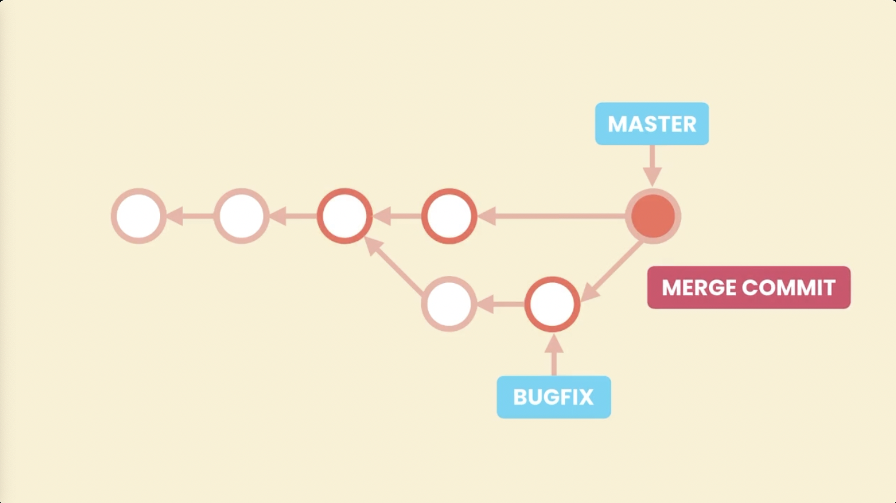

# git-notes

## Working on a forked repository

1. Fork a remote repository for an open source project and clone it on your local machine

<p align="center">

</p>

```bash
git clone https://github.com/your-username/forked_repo-name.git
```

- This forked repository is not connected to the original repository, so from time to time, it can become out of sync with the original repository. If other people contribute to the base repository and add new commits to the main branch, you are not going to be aware of those new commits.

To fix this and keep the forked repository up to date:

2. In the local repository you have a reference to the forked repository called `origin`. Add another reference to the original repository called `base`.

<p align="center">

</p>

```bash
git remote add base https://github.com/original-owner/repo-name.git
```

3. Pull the commits from the `base` repository and then push them to the forked (`origin`) repositroy.

<p align="center">

</p>

```bash
# Fetch the Latest Commits from the Original Repository:
git fetch base
# Merge the Changes into Your Local Main Branch:
git checkout main
git merge base/main
# Push the Changes to Your Forked Repository:
git push origin main
```

## Collaborative Workflow Best Practices

### Step 1: Check remote directory

A remote is a shared Git repository that allows multiple collaborators to work on the same Git project from different locations.
To view the remote directory, type

```bash
git remote -v
```

If remote directory has never been added to your local directory, use the following command

```bash
git clone remote_location clone_name
```

Otherwise, move onto step 2

### Step 2: Fetch changes from the remote

```bash
git fetch
```

In Git, the git fetch command downloads objects from the origin remote repository.
The changes, however, are not merged into the current branch-name branch.
Instead, they are stored in the origin/branch-name branch, waiting to be merged.

#### Example:

```bash
git branch -a
* master

git fetch
remote: Counting objects: 5, done.
remote: Compressing objects: 100% (5/5), done.
remote: Total 5 (delta 1), reused 0 (delta 0)
Unpacking objects: 100% (5/5), done.
From /home/ccuser/workspace/curriculum-a/science-quizzes
 * [new branch]      master     -> origin/master

git branch -a
* master
  remotes/origin/master
```

In the provided example, using the git branch -a command to see the existing branches, you can see that fetched data has been stored in a new origin/master branch.

### Step 3: Merge changes from the remote

```bash
git merge origin/branch-name
```

### Step 4: Create a branch to work on a new project feature and switch over to that branch

```bash
git branch new-branch
git switch new-branch
```

### Step 5: Develop the feature on a branch and commit the work

```bash
git add files
git commit -m "message"
```

### Step 6: Fetch and merge from the remote again (in case new commits were made)

```bash
git fetch
git merge origin/branch-name
```

Steps 2 and 6 are a safeguard against merge conflicts, which occur when two branches contain file changes that cannot be merged with the git merge command.

### Step 7: Push branch up to the remote for review

```bash
git push origin branch-name
```

### Step 8: Switch back to main branch and delete new branch (if new feature is fully complete)

```bash
git switch main
git branch -D branch-name
```

## Git cheatsheets


- https://jdsalaro.com/cheatsheet/git/index.html

# What is Git?

Git is the most popular version control system in the world because it's free, open source, super fast and scalable.

## Git Configuration

When using Git for the first time, it's important to set up a few configuration settings to ensure your environment behaves consistently. These settings help Git associate your commits with your identity, choose the right editor, and handle line endings properly.

Git settings can be configured at **three levels**:

- **System level**: Applies to all users and repositories on the machine.
- **Global level**: Applies to all repositories for the current user.
- **Local level**: Applies to the specific repository in the current folder.


You can use the `git config` command with different flags to specify the level.

### Step 1. **Set Your User Name and Email**

These are required to associate commits with your identity.

```bash
git config --global user.name "Your Full Name"
git config --global user.email your.email@example.com
```

- Use **double quotes** if your name includes spaces.
- No need for quotes around the email unless it contains spaces (which is rare).

### Step 2. **Set Your Default Editor**

If you don't specify an editor, on Mac, Git uses the system default—like `vim`, which may be unfamiliar.

To use **Visual Studio Code**:

```bash
git config --global core.editor "code --wait"
```

- The `--wait` flag tells Git to pause until you close the VS Code window.
- Make sure `code` is in your system's path. If not, follow platform-specific instructions to add it.

### Step 3. **Edit Global Git Config File**

All global Git settings are stored in a plain text config file. You can edit it manually:

```bash
git config --global -e
```

This opens the global config file in your default editor (e.g., VS Code). You'll see:

```ini
[user]
  name = Your Full Name
  email = your.email@example.com

[core]
  editor = code --wait
```

You can make manual changes here if needed.

### Step 4. **Configure Line Endings (core.autocrlf)**

Different operating systems handle end-of-line characters differently:

- **Windows**: Uses carriage return + line feed (`\r\n`) (`CRLF`)
- **macOS/Linux**: Use just line feed (`\n`)(`LF`)


Misaligned line endings can cause annoying diffs and conflicts. To manage this properly, configure the `core.autocrlf` setting.

#### Windows Users:

```bash
git config --global core.autocrlf true
```

- Converts `CRLF` to `LF` when storing files in the repo.
- Converts `LF` back to `CRLF` when checking out files.

#### macOS/Linux Users:

```bash
git config --global core.autocrlf input
```

- Converts `CRLF` to `LF` when storing files in the repo.
- Leaves line endings untouched on checkout.

This ensures consistent line endings across platforms and prevents errors in collaboration.


### Summary of Configuration Commands

```bash
# Set user identity
git config --global user.name "Your Name"
git config --global user.email your.email@example.com

# Set preferred text editor
git config --global core.editor "code --wait"

# Configure line endings
git config --global core.autocrlf true     # For Windows
git config --global core.autocrlf input    # For macOS/Linux

# Open global config file
git config --global -e
```

By setting up these configurations at the beginning, you ensure Git behaves predictably and avoids platform-related issues—especially with line endings.

## Git Workflow Basics

The daily Git workflow involves three main areas: the **working directory**, the **staging area** (also called the index), and the **repository**. Understanding how these areas interact is crucial for effective Git usage.

### The Three Areas of Git

1. **Working Directory**: Your project folder where you make changes to files
2. **Staging Area**: An intermediate step that holds what you're proposing for the next commit
3. **Repository**: The permanent storage where your project history is maintained

### Daily Workflow Process

The basic workflow follows these steps:

1. **Make Changes**: Modify files in your working directory
2. **Stage Changes**: Add modified files to the staging area using `git add`
3. **Review Changes**: Check what's staged before committing
4. **Commit Changes**: Permanently store the staged snapshot in the repository

### Understanding the Staging Area

The staging area is a unique feature of Git that doesn't exist in most other version control systems. It serves as:

- **A review mechanism**: You can review changes before committing
- **A selective commit tool**: You can stage only specific changes for a commit
- **A preparation area**: It holds what will become your next commit

#### ⚠️ Important Concept: Staging Area Persistence ⚠️

A common misconception is that the staging area becomes empty after a commit. This is incorrect. **After committing, the staging area contains the same snapshot that was just stored in the repository**. Think of it like a staging environment in software deployment—it either reflects what's currently in production or what's going to be deployed next.

### Practical Example

Let's walk through a complete workflow example:

#### Step 1: Initial Setup

```bash
# Start with an empty project directory
mkdir my-project
cd my-project
git init
```

#### Step 2: Add Files and Make First Commit

```bash
# Create some files
echo "Hello World" > file1.txt
echo "Git is awesome" > file2.txt
```


```bash
# Stage the files
git add file1.txt file2.txt
```


```bash
# Review what's staged
git status

# Commit the changes
git commit -m "Initial commit: Add basic files"
```


#### Step 3: Make Changes and Commit Again

```bash
# Modify a file
echo "Hello World - Updated" > file1.txt
```


```bash
# Stage the changes
git add file1.txt
```


```bash
# Commit with descriptive message
git commit -m "Fix typo in file1.txt"
```


#### Step 4: Delete Files

```bash
# Remove a file from working directory
rm file2.txt
```


```bash
# Stage the deletion
git add file2.txt
```


> **💡 Note**: Even though we're using `git add file2.txt` on a deleted file, Git understands this as staging the deletion. The `git add` command stages the current state of the working directory, whether that's adding new files, modifying existing files, or removing files.

```bash
# Commit the deletion
git commit -m "Remove unused file2.txt"
```


### How Git Stores Data

Unlike many version control systems that store deltas (changes), Git stores **complete snapshots** of your project at each commit. This allows Git to:

- Quickly restore the project to any previous state
- Efficiently compress and deduplicate data
- Provide fast access to any version of your project

Each commit contains:

- A unique identifier (hash)
- Information about who made the change and when
- A complete snapshot of the project at that point in time
- References to parent commits


This snapshot-based approach makes Git extremely efficient and reliable for version control.

Even though Git stores the whole content of the project in each snapshot, it doesn't take up too much memory because Git is very efficient. It compresses the data and doesn't store any duplicate content.


## Staging Files

### Initial File Creation

When you first initialize a Git repository, Git doesn't automatically track any files. You need to explicitly tell Git which files to track. Let's see this in action:

```bash
# Create files using standard Unix/Linux commands
echo "hello" > file1.txt
echo "hello" > file2.txt
```

After creating files, running `git status` will show them as **untracked files** (indicated in red), meaning Git is not yet tracking them.

### Adding Files to Git

To start tracking files, you use the `git add` command:

```bash
# Add a single file
git add file1.txt

# Add multiple files
git add file1.txt file2.txt

# Add all files with a specific extension
git add *.txt

# Add all files in the current directory (use with caution)
git add .
```

> **⚠️ CAUTION**: Be careful with `git add .` as it adds the entire directory recursively. You might accidentally add files you don't want in your repository (like large binary files, log files, or temporary files). To prevent this behaviour, d.

### Understanding File States

After adding files, `git status` will show them in **green**, indicating they're now in the staging area and ready to be committed.

### Modifying Files After Staging

Here's an important concept: when you modify a file after adding it to the staging area, Git maintains two versions:

1. **Staging Area**: Contains the version that was staged
2. **Working Directory**: Contains the current modified version

```bash
# Modify a file after staging it
echo "world" >> file1.txt  # Append "world" to file1.txt
```

Running `git status` now shows:

- Files in the staging area (green) - ready to commit
- Modified files in the working directory (red) - not yet staged


### Re-staging Modified Files

To include the latest changes in your next commit, you need to re-stage the modified file:

```bash
# Re-stage the modified file
git add file1.txt
# or
git add .
```

Now `git status` shows all files are staged and ready for commit.

### Key Points to Remember

1. **Git doesn't auto-track files**: You must explicitly add files to start tracking them
2. **Staging is a snapshot**: When you `git add` a file, Git takes a snapshot of its current state
3. **Modifications require re-staging**: If you modify a file after staging it, you need to stage it again
4. **Use `git status` frequently**: It helps you understand what's staged vs. what's in your working directory

## Committing Changes

Once you have files staged in the staging area, you can commit them to permanently store the snapshot in your Git repository.

### Basic Commit with Message

The most common way to commit is using the `-m` flag to provide a commit message:

```bash
git commit -m "Initial commit"
```

This creates a commit with a short, descriptive message that identifies what the snapshot represents.

### Detailed Commit Messages

Sometimes a short one-liner isn't sufficient. You might need to explain context, constraints, or provide additional details. For detailed commit messages:

```bash
git commit
```

This opens your default editor (like VS Code) where you can write a multi-line commit message:

```bash
# Example commit message format:
Initial commit

This is our first commit to the repository. We're adding basic file structure
and initial content to get started with the project.
```

**Commit Message Format:**

- **First line**: Short description (ideally under 80 characters)
- **Blank line**: Separates short description from detailed description
- **Detailed description**: Additional context, explanations, or constraints

> **💡 Note**: Lines starting with `#` are comments and will be ignored by Git.

### Commit Statistics

After committing, Git shows statistics about what was changed:

```bash
[main (root-commit) abc1234] Initial commit
 2 files changed, 3 insertions(+)
 create mode 100644 file1.txt
 create mode 100644 file2.txt
```

This tells you:

- Number of files changed
- Number of lines inserted/deleted
- Which files were created/modified

### Working Directory State After Commit

After a successful commit:

- Your working directory becomes "clean" (no uncommitted changes)
- The staging area contains the same content as the last commit
- All three areas (working directory, staging area, repository) are in sync

### Best Practices for Committing

#### 1. **Commit Size**

- **Don't commit too frequently**: Avoid commits like "update file1", "update file2"
- **Don't commit too infrequently**: Don't wait days or weeks to commit
- **Aim for logical checkpoints**: Commit when you reach a meaningful state
- **Real-world guideline**: 5-10 commits per day (but don't force it)

#### 2. **Logical Separation**

Each commit should represent a single, logical unit of work:

```bash
# ❌ Bad: Mixing unrelated changes
git commit -m "Fix bug and fix typo"

# ✅ Good: Separate commits for separate concerns
git commit -m "Fix authentication bug in login form"
git commit -m "Fix typo in README file"
```

#### 3. **Meaningful Commit Messages**

- **Be descriptive**: Explain what the commit accomplishes
- **Use present tense**: "Fix bug" instead of "Fixed bug"
- **Be consistent**: Follow the same convention across your team
- **Keep it simple**: If your commit represents a single unit of work, writing a good message becomes easier

#### 4. **Commit Message Examples**

```bash
# ✅ Good examples:
git commit -m "Add user authentication feature"
git commit -m "Fix memory leak in image processing"
git commit -m "Update API documentation"
git commit -m "Refactor database connection logic"

# ❌ Bad examples:
git commit -m "stuff"
git commit -m "fix"
git commit -m "updates"
git commit -m "wip"
```

### Unstaging Changes

If you accidentally stage changes that shouldn't be in the same commit, you can unstage them:

```bash
# Unstage a specific file
git reset HEAD <filename>

# Unstage all files
git reset HEAD
```

This moves files back to the working directory without losing your changes.

## Skipping the Staging Area

### Quick Commit with `-a` Flag

One common question beginners have is whether you always need to stage changes before committing. The answer is **no** - you can skip the staging area, but use this carefully.

```bash
# Skip staging and commit all modified files in one step
git commit -a -m "Fix the bug that prevented users from signing up"
# or combine the flags
git commit -am "Fix the bug that prevented users from signing up"
```

> **⚠️ CAUTION**: Only use this when you're 100% sure your changes don't need review. The staging area exists for a reason - to let you review changes before committing. **99% of the time, you should stage your code before committing**.

### When to Use Quick Commits

- **Simple, obvious changes**: Minor fixes or typo corrections
- **Single file modifications**: When you're only changing one file
- **Confident changes**: When you're certain the changes are correct

### When to Avoid Quick Commits

- **Multiple file changes**: Always review when touching multiple files
- **Complex changes**: Any significant modifications should be staged and reviewed
- **Team collaboration**: Always stage changes when working with others

### Best Practices

1. **Meaningful Commit Messages**: Each commit should have a clear, descriptive message explaining what the snapshot represents
2. **Review Before Committing**: Always check what's staged using `git status` before committing
3. **Atomic Commits**: Group related changes togethe dr in single commits
4. **Frequent Commits**: Make commits often to create a detailed project history

## Removing Files from Git

### Manual File Removal

To remove a file from your project, you need to remove it from both the working directory and the staging area:

```bash
# Remove file from working directory (Unix command)
rm file2.txt

# Stage the deletion
git add file2.txt

# Commit the deletion
git commit -m "Remove unused code"
```

### Understanding the Process

When you delete a file with `rm`, **it's only removed from your working directory**. The file still exists in the staging area until you stage the deletion:

```bash
# Check what files are in the staging area
git ls-files

# After running 'rm file2.txt', file2.txt will still appear here
# until you stage the deletion with 'git add file2.txt'
```

### Using `git rm` (Recommended)

Git provides a convenient command that removes a file from both the working directory and staging area in one step:

```bash
# Remove file from both working directory and staging area
git rm file2.txt

# Remove multiple files
git rm file1.txt file2.txt file3.txt

# Remove files using patterns
git rm *.txt

# Commit the removal
git commit -m "Remove unused files"
```

### Advantages of `git rm`

1. **One-step operation**: Removes from both working directory and staging area
2. **Safer**: Less chance of forgetting to stage the deletion
3. **Clearer intent**: Makes it obvious you're removing files from Git tracking
4. **Consistent**: Follows Git's workflow patterns

### File Removal Best Practices

- **Use `git rm`**: Prefer `git rm` over manual `rm` + `git add`
- **Meaningful commit messages**: Explain why you're removing the file
- **Review before committing**: Make sure you're not accidentally removing needed files
- **Consider `.gitignore`**: For files you want to stop tracking but keep locally

## Renaming and Moving Files

### Manual File Renaming

Renaming or moving files in Git is a two-step operation that involves both deletion and addition:

```bash
# Step 1: Rename the file in your working directory
mv file1.txt main.js

# Step 2: Stage both the deletion and addition
git add file1.txt    # Stage the deletion of the old file
git add main.js      # Stage the addition of the new file

# Step 3: Commit the changes
git commit -m "Rename file1.txt to main.js"
```

### Understanding the Process

When you rename a file manually, Git recognizes it as two separate operations:

- **Deletion**: The old filename is removed
- **Addition**: The new filename is added

Running `git status` will show:

```bash
Changes to be committed:
  deleted:    file1.txt
  new file:   main.js
```

### Using `git mv` (Recommended)

Git provides a convenient command that handles renaming in one step:

```bash
# Rename file using git mv
git mv main.js file1.js

# Move file to a different directory
git mv file1.js src/file1.js

# Commit the rename operation
git commit -m "Refactor code: rename main.js to file1.js"
```

### Advantages of `git mv`

1. **One-step operation**: Handles both deletion and addition automatically
2. **Preserves history**: Git maintains the file's history across the rename
3. **Safer**: Less chance of forgetting to stage one of the operations
4. **Clearer intent**: Makes it obvious you're renaming/moving files

### File Rename Statistics

When you commit a rename operation, Git shows statistics like:

```bash
[main abc1234] Refactor code
 1 file changed, 0 insertions(+), 0 deletions(-)
 rename file1.txt => file1.js (100%)
```

This indicates:

- One file was changed (renamed)
- No lines were added or deleted (content remained the same)
- The file was 100% renamed (not just partially moved)

### Rename Best Practices

- **Use `git mv`**: Prefer `git mv` over manual `mv` + `git add`
- **Meaningful commit messages**: Explain why you're renaming the file
- **Preserve history**: `git mv` maintains the file's commit history
- **Consider impact**: Renaming files can affect other parts of your project

## The .gitignore File

A `.gitignore` file is used to keep a tidy and efficient repository. It tells Git which files or directories to ignore, ensuring that unnecessary clutter—like temporary files, logs, and build artifacts—doesn't get committed. This not only keeps your repository clean but also improves collaboration by preventing irrelevant files from being shared among team members.

A `.gitignore` file works by specifying patterns for files and directories that Git should ignore when tracking changes.

Step 1. **Creating the File**

- To use `.gitignore`, simply create a text file named `.gitignore` in the root of your repository. This file can contain a list of patterns for files and directories you want Git to ignore.

Step 2. **Pattern Matching**

- Inside the `.gitignore` file, you can specify patterns using various rules:

  - **Basic patterns:** Just the name of a file or directory (e.g., `temp/` ignores the `temp` directory).
  - **Wildcards:** Use `*` to match any characters (e.g., `*.log` ignores all `.log` files).

    - The double asterisk (`**`) in a `.gitignore` file is a powerful wildcard pattern that allows you to match files and directories at any level of the directory hierarchy.

      - Usage of `**`

        1. **Match Any Directory Depth** :

           - You can use `**` to match files or directories regardless of how deep they are nested. For example:

             ```javascript
             **/temp/
             ```

             This pattern will ignore any directory named `temp`, no matter where it appears in the project structure (e.g., `src/temp/`, `logs/temp/`, etc.).

        2. **Match Files Across Directories** :

        - If you want to ignore all files of a certain type in any subdirectory, you can specify:

          ```bash
          **/*.log
          ```

          This will ignore all `.log` files in any directory, such as `logs/file.log` or `data/logs/another_file.log`.

        3. **Combining with Other Patterns** :

        - You can combine `**` with other patterns to create more complex rules. For example:

          ```javascript
          **/build/**/*
          ```

          This ignores all files in any `build` directory, regardless of its depth.

        #### Examples

        - **Ignore All Folders Named `node_modules`** :

          ```javascript
          **/node_modules/
          ```

        - **Ignore All `.tmp` Files in Any Directory** :

          ```
          **/*.tmp
          ```

        - **Ignore All Files Named `config.json` in Any Directory** :

          ```arduino
          **/config.json
          ```

  - **Negation:** Prefix a pattern with `!` to negate it, meaning that Git will track files that match this pattern even if a broader pattern would ignore them (e.g., `!important.log` allows tracking of `important.log`).
  - **Comments:** Lines starting with `#` are treated as comments and ignored.

Step 3. **Effect on Tracking**

- When you run `git add`, Git checks the `.gitignore` file and skips any files or directories that match the specified patterns. This means they won't be staged for commit or included in your repository.

Step 4. **Updating the `.gitignore`**

- If you add new files or directories that you want to ignore after the initial commit, you may need to remove them from tracking using, because `.gitignore` only ignores files and directories in git that you haven't already included in your directory or repository. So if you accidentally include a file in your git repository and then later add it to `.gitignore`, git **is not** going to ignore that. To stop this problem, you have to remove this file from the staging area, which is what you're proposing for the next commit. To see the files in your directory, you can use:

  ```bash
  git ls-files
  ```

- The `git rm` command allows you to remove a file from **both** the working directory and the staging area. In this case, you don't want to remove the file from the working directoy, but you do want to remove it from the staging area (from the index). To do this you will use `git rm --cached`. You may have to use the recursive removal flag, `-r`, to remove directories from the staging area.

  ```bash
  git rm --cached -r <file|directory>
  ```

- Then, adding the appropriate patterns to your `.gitignore` file will prevent them from being tracked in future commits.

Step 5. **Global `.gitignore**

- You can also set up a global `.gitignore` file that applies to all your repositories. This is useful for ignoring files like OS-specific files or IDE configurations. You can configure it with:

```bash
git config --global core.excludesfile ~/.gitignore_global
```

If you go to [github.com/github/gitignore](https://github.com/github/gitignore), you can see various `.gitignore` templates from various different languages.

### Common Files to Ignore

Here are examples of typical files and directories you might want to ignore:

```bash
# Log files
*.log
logs/

# Binary files
*.exe
*.dll
*.so
*.dylib

# Build artifacts
build/
dist/
node_modules/

# Temporary files
*.tmp
*.temp
.cache/

# Environment files
.env
.env.local
.env.production

# IDE files
.vscode/
.idea/
*.swp
*.swo
```

### .gitignore Best Practices

- **Be specific**: Don't ignore entire directories unless necessary
- **Consider team needs**: Make sure ignored files don't break the project for others
- **Document exceptions**: Use `!` to force-include specific files in ignored directories
- **Test your patterns**: Make sure you're not accidentally ignoring important files

Using a `.gitignore` file is a simple yet powerful way to maintain a clean and organized repository, ensuring that only relevant files are tracked by Git. This helps streamline collaboration and keeps your version history focused on the actual project files.

## Short Status

The `git status` command provides comprehensive but verbose output. For a more concise view, use the `-s` (short) flag:

```bash
# Verbose status output
git status

# Short status output
git status -s
```

### Understanding Short Status Output

The short status shows two columns:

- **Left column**: Staging area (index)
- **Right column**: Working directory

### Status Indicators

| Symbol | Meaning        |
| ------ | -------------- |
| `M`    | Modified file  |
| `A`    | Added file     |
| `D`    | Deleted file   |
| `R`    | Renamed file   |
| `C`    | Copied file    |
| `U`    | Unmerged file  |
| `??`   | Untracked file |

### Example Workflow

```bash
# Modify an existing file and create a new one
echo "sky" >> file1.js
echo "sky" > file2.js

# Check status
git status -s
# Output: M  file1.js
#         ?? file2.js

# Stage file1.js
git add file1.js
git status -s
# Output: M  file1.js
#         ?? file2.js

# Modify file1.js again after staging
echo "ocean" >> file1.js
git status -s
# Output: MM file1.js
#         ?? file2.js

# Re-stage file1.js
git add file1.js
git status -s
# Output: M  file1.js
#         ?? file2.js

# Stage file2.js
git add file2.js
git status -s
# Output: M  file1.js
#         A  file2.js
```

## Viewing the Staged and Unstaged Changes

Before committing, it's essential to review your changes. The `git diff` command shows you exactly what lines have been modified.

### Viewing Staged Changes

To see what's staged for the next commit:

```bash
git diff --staged
# or
git diff --cached
```

### Viewing Unstaged Changes

To see changes in your working directory that aren't staged:

```bash
git diff
```

### Understanding Diff Output

The diff output follows this format:

```bash
diff --git a/file1.js b/file1.js
index abc1234..def5678 100644
--- a/file1.js
+++ b/file1.js
@@ -1,3 +1,5 @@
 hello
 world
+sky
+ocean
```


**Key elements:**

- `--- a/file1.js`: Old version (from last commit or staging area)
- `+++ b/file1.js`: New version (from staging area or working directory)
- `-` (red): Lines removed
- `+` (green): Lines added
- `@@ -1,3 +1,5 @@`: Context showing line numbers and chunk size

### Diff Best Practices

- **Always review before committing**: Use `git diff --staged` or `git diff --cached` to see what will be committed
- **Check unstaged changes**: Use `git diff` to see what still needs to be staged
- **Understand the output**: Learn to read diff format for terminal-only environments

## Visual Diff Tools

While terminal diffs are powerful, visual tools make comparing files much easier.

### Popular Visual Diff Tools

- **Kdiff3**: Cross-platform, free
- **P4Merge**: Cross-platform, free
- **WinMerge**: Windows only, free
- **VS Code**: Built-in diff viewer

### Configuring VS Code as Diff Tool

```bash
# Set VS Code as the default diff tool
git config --global diff.tool vscode

# Configure the command to launch VS Code
git config --global difftool.vscode.cmd "code --wait --diff $LOCAL $REMOTE"
```

### Using Visual Diff Tools

```bash
# View unstaged changes
git difftool

# View staged changes
git difftool --staged
# or
git difftool --cached
```

### VS Code Configuration Details

The configuration includes:

- `--wait`: Terminal waits until VS Code is closed
- `--diff`: Tells VS Code to open in diff mode
- `$LOCAL`: Placeholder for the old file version
- `$REMOTE`: Placeholder for the new file version

> **💡 Note**: Modern editors and IDEs often have built-in Git integration that shows staged and unstaged changes directly in the development environment, making dedicated diff tools less necessary for daily use.

## Viewing the History

The `git log` command shows your commit history, allowing you to see what changes were made and when.

### Basic Log Command

```bash
git log
```

**Output includes:**

- Commit hash (unique identifier)
- Author name and email
- Date and time
- Commit message

### Log Output Example

```bash
commit d601b90abc123def456
Author: John Doe <john@example.com>
Date:   Mon Jan 15 10:30:00 2024 +0000

    Add user authentication feature

commit a1b2c3d4e5f678901
Author: John Doe <john@example.com>
Date:   Mon Jan 15 09:15:00 2024 +0000

    Initial commit
```

### Useful Log Options

```bash
# One-line format (shorter output)
git log --oneline

# Reverse order (oldest first)
git log --reverse

# Combine options
git log --oneline --reverse

# Limit number of commits
git log -n 5

# Show commits by specific author
git log --author="John Doe"
```

### Understanding Commit References

- **HEAD**: Points to the current branch
- **master/main**: The main branch (primary line of development)
- **Commit hash**: Unique identifier for each commit
- **Short hash**: First 7 characters of the full hash

### Navigation in Log Output

- **Space**: Go to next page
- **Enter**: Go to next line
- **q**: Quit and return to terminal

## Viewing a Commit

The `git show` command displays detailed information about a specific commit.

### Basic Show Command

```bash
# Show the latest commit
git show

# Show a specific commit by hash
git show d601b90

# Show with one-line format
git show --oneline d601b90
```

### Show Output Example

```bash
commit d601b90abc123def456
Author: John Doe <john@example.com>
Date:   Mon Jan 15 10:30:00 2024 +0000

    Add user authentication feature

diff --git a/auth.js b/auth.js
new file mode 100644
index 0000000..abc1234
--- /dev/null
+++ b/auth.js
@@ -0,0 +1,10 @@
+function login(username, password) {
+    // Authentication logic
+    return validateCredentials(username, password);
+}
+
+function logout() {
+    // Logout logic
+    clearSession();
+}
```

### What Show Displays

1. **Commit metadata**: Hash, author, date, message
2. **File changes**: Which files were modified
3. **Diff output**: Exact lines that were added/removed
4. **Statistics**: Number of files and lines changed

### Referencing Commits

```bash
# By full hash
git show d601b90abc123def456

# By short hash (first 7+ characters)
git show d601b90

# By relative reference
git show HEAD~1    # Previous commit
git show HEAD~2    # Two commits back

# By branch name
git show main      # Latest commit on main branch
```

### Show Options

```bash
# Show only the commit message
git show --no-patch d601b90

# Show only the diff
git show --stat d601b90

# Show in a specific format
git show --format=fuller d601b90
```

## Unstaging Files

After reviewing your staged changes, you might realize that some files shouldn't be part of the next commit. Git provides the `restore` command to unstage files (requires Git 2.23+).

### Using `git restore` to Unstage

```bash
# Unstage a specific file
git restore --staged file1.js

# Unstage multiple files
git restore --staged file1.js file2.js

# Unstage all files in the staging area
git restore --staged .
```

### How `git restore --staged` Works

The `restore` command restores files from a specified source:

- **With `--staged`**: By default, restores from HEAD (last commit)
- **Without `--staged`**: By default, restores from the index (staging area)

When you unstage a file, Git:

1. Takes the version from HEAD (last commit)
2. Places it in the staging area
3. Your working directory changes remain untouched

### Example Workflow

```bash
# Check current status
git status -s
# Output: M  file1.js
#         A  file2.js

# Unstage file1.js
git restore --staged file1.js

# Check status again
git status -s
# Output:  M file1.js    (unstaged changes)
#          A file2.js    (still staged)
```

### Handling New Files

For new files (untracked files that were staged):

- When you unstage them, they return to "untracked" status
- They appear as `??` in the status output
- This is because they don't exist in the last commit

## Discarding Local Changes

Sometimes you want to completely discard changes in your working directory and start over.

### Discarding Changes in Working Directory

```bash
# Discard changes in a specific file
git restore file1.js

# Discard all local changes
git restore .
```

### How `git restore` Works for Working Directory

When you restore a file in the working directory:

- Git takes the version from the index (staging area)
- Copies it to your working directory
- Any uncommitted changes are lost

### Removing Untracked Files

The `restore` command only works for tracked files. To remove untracked files:

```bash
# See what would be removed (dry run)
git clean -n

# Remove untracked files
git clean -f

# Remove untracked files and directories
git clean -fd

# Remove untracked files, directories, and ignored files
git clean -fdx
```

> **⚠️ CAUTION**: The `git clean` command permanently deletes files. There's no way to recover them once deleted. Always use `git clean -n` first to see what will be removed. The command requires the `-f` (force) flag to actually delete files.

### Complete Cleanup Example

```bash
# Check current status
git status -s
# Output:  M file1.js    (modified tracked file)
#         ?? file2.js    (untracked file)

# Discard changes in tracked file
git restore file1.js

# Remove untracked file
git clean -f

# Verify clean state
git status -s
# Output: (clean working directory)
```

## Restoring a File to an Earlier Version

Git stores every version of tracked files in its database, allowing you to restore files to any previous state.

### Restoring from a Specific Commit

```bash
# Restore a file to its state in the last commit
git restore file1.js

# Restore a file to its state in a specific commit
git restore --source=HEAD~1 file1.js

# Restore a file to its state in a specific commit (alternative syntax)
git restore --source=abc1234 file1.js
```

### Understanding the `--source` Parameter

The `--source` parameter tells Git where to get the file version from:

- **Default behavior**:
  - With `--staged`: Restores from HEAD
  - Without `--staged`: Restores from the index (staging area)
- **`--source=HEAD~1`**: Restores from the commit before HEAD
- **`--source=abc1234`**: Restores from a specific commit hash
- **`--source=main`**: Restores from the latest commit on main branch

### Example: Restoring a Deleted File

```bash
# Delete a file
git rm file1.js
git commit -m "Delete file1.js"

# Realize you need the file back
git restore --source=HEAD~1 file1.js

# Check status
git status -s
# Output: ?? file1.js    (restored as untracked file)
```

### Restore Command Options

```bash
# Restore file to working directory
git restore file1.js

# Restore file to staging area
git restore --staged file1.js

# Restore file to working directory from specific source
git restore --source=HEAD~1 file1.js

# Restore file to staging area from specific source
git restore --staged --source=HEAD~1 file1.js
```

### Best Practices for File Restoration

1. **Always review before restoring**: Use `git log` to find the right commit
2. **Use specific commit references**: Be explicit about which version you want
3. **Check status after restoration**: Verify the file is in the expected state
4. **Consider the impact**: Restoring files can affect other parts of your project
5. **Use `--staged` when appropriate**: Decide whether to restore to staging area or working directory

---

## Browsing the History

This section covers advanced techniques for exploring and understanding your Git repository's history. We'll work with a sample repository to demonstrate various ways to view, filter, and format commit history.

## Getting a Repository

To follow along with the examples in this section, you'll need a repository with some history to work with. You can:

1. **Use your own repository**: Any Git repository with multiple commits
2. **Create a sample repository**: Make several commits to practice with
3. **Download a sample**: Use a repository like the "Venus" project mentioned in the course

The key is having a repository with enough commits to demonstrate the filtering and browsing capabilities.

## Filtering the History

In real repositories, you often have hundreds or thousands of commits. Git provides powerful filtering options to help you find specific commits.

### Limiting the Number of Commits

```bash
# Show only the last 3 commits
git log --oneline -3

# Show only the last 5 commits
git log --oneline -5
```

### Filtering by Author

```bash
# Show commits by a specific author
git log --oneline --author="John Doe"

# Show commits by author (case-insensitive)
git log --oneline --author="john"

# Show commits by author using regex pattern
git log --oneline --author="John.*"
```

### Filtering by Date

```bash
# Show commits from a specific date onwards
git log --oneline --since="2020-08-17"

# Show commits before a specific date
git log --oneline --before="2020-08-17"

# Show commits from yesterday
git log --oneline --since="yesterday"

# Show commits from one week ago
git log --oneline --since="1 week ago"

# Show commits from two days ago
git log --oneline --since="2 days ago"

# Show commits from one month ago
git log --oneline --since="1 month ago"
```

### Filtering by Commit Message

```bash
# Show commits with "bug" in the message (case-sensitive)
git log --oneline --grep="bug"

# Show commits with "feature" in the message
git log --oneline --grep="feature"

# Show commits with "bug" in the message (case-insensitive)
git log --oneline --grep="bug" -i

# Show commits that match multiple patterns
git log --oneline --grep="bug" --grep="fix"
```

### Filtering by Content

```bash
# Show commits that added or removed specific content
git log --oneline -S "function_name"

# Show commits that added or removed specific text
git log --oneline -S "objectives"

# Show commits that changed content matching a regex pattern
git log --oneline -G "function.*"
```

### Filtering by Commit Range

```bash
# Show commits between two specific commits
git log --oneline abc123..def456

# Show commits from a specific commit to HEAD
git log --oneline abc123..HEAD
```

### Filtering by File

```bash
# Show commits that modified a specific file
git log --oneline filename.txt

# Show commits that modified multiple files
git log --oneline file1.txt file2.txt

# Use -- to separate options from filenames (if needed)
git log --oneline -- filename.txt
```

## Formatting the Log Output

Git's `log` command is highly customizable. You can create your own output format to display exactly the information you need.

### Using `--pretty=format`

```bash
# Basic custom format
git log --pretty=format:"%h - %an, %ar : %s"

# More detailed format
git log --pretty=format:"%C(green)%an%C(reset) committed %C(blue)%h%C(reset) on %C(yellow)%cd%C(reset)"
```

### Common Format Placeholders

| Placeholder | Description                           |
| ----------- | ------------------------------------- |
| `%H`        | Full commit hash                      |
| `%h`        | Abbreviated commit hash               |
| `%an`       | Author name                           |
| `%ae`       | Author email                          |
| `%ad`       | Author date (respects --date= option) |
| `%ar`       | Author date, relative                 |
| `%at`       | Author date, UNIX timestamp           |
| `%s`        | Subject (commit message)              |
| `%b`        | Body (commit message body)            |
| `%n`        | Newline                               |
| `%cn`       | Committer name                        |
| `%ce`       | Committer email                       |

### Color Formatting

```bash
# Color the author name in green
git log --pretty=format:"%C(green)%an%C(reset) committed %h"

# Color the commit hash in blue
git log --pretty=format:"%an committed %C(blue)%h%C(reset)"

# Color the date in yellow
git log --pretty=format:"%an committed %h on %C(yellow)%ar%C(reset)"
```

### Common Color Options

- `%C(red)` - Red text
- `%C(green)` - Green text
- `%C(blue)` - Blue text
- `%C(yellow)` - Yellow text
- `%C(reset)` - Reset to default color
- `%C(auto)` - Automatic color based on Git's color scheme

## Creating Aliases

Git aliases allow you to create shortcuts for frequently used commands, making your workflow more efficient.

### Setting Up Aliases

```bash
# Create a custom log alias
git config --global alias.lg "log --pretty=format:'%C(green)%an%C(reset) committed %C(blue)%h%C(reset) on %C(yellow)%ar%C(reset)'"

# Create an unstage alias
git config --global alias.unstage "restore --staged ."

# Create a last alias to see the last commit
git config --global alias.last "log -1 HEAD"

# Create a shell command alias (note the ! prefix)
git config --global alias.visual "!gitk --all --not ORIG_HEAD"
```

### Using Aliases

```bash
# Use your custom log format
git lg

# Unstage all files
git unstage

# See the last commit
git last
```

### Viewing Your Aliases

```bash
# List all aliases
git config --get-regexp alias

# Edit aliases in your config file
git config --global -e

# View a specific alias
git config --get alias.lg
```

### Example Alias Configuration

Your `.gitconfig` file might look like this:

```ini
[alias]
    lg = log --pretty=format:'%C(green)%an%C(reset) committed %C(blue)%h%C(reset) on %C(yellow)%ar%C(reset)'
    unstage = restore --staged .
    last = log -1 HEAD
    st = status
    co = checkout
    br = branch
```

## Viewing a Commit

The `git show` command provides detailed information about specific commits.

### Basic Show Command

```bash
# Show the latest commit
git show

# Show a specific commit by hash
git show abc123

# Show a commit using relative reference
git show HEAD~2
```

### Show Options

```bash
# Show only the commit message (no diff)
git show --no-patch HEAD~2

# Show only the names of changed files
git show --name-only HEAD~2

# Show file names and change types
git show --name-status HEAD~2

# Show statistics
git show --stat HEAD~2
```

### Viewing File Content in a Commit

```bash
# Show the content of a specific file in a commit
git show HEAD~2:path/to/file.txt

# Show the content of a file in the root directory
git show HEAD~2:README.md
```

### Understanding Show Output

The `git show` command displays:

1. **Commit metadata**: Hash, author, date, message
2. **File changes**: Which files were modified
3. **Diff output**: Exact lines that were added/removed
4. **Statistics**: Number of files and lines changed

## Viewing the Changes Across Commits

The `git diff` command can compare any two commits to see what changed between them.

### Comparing Two Commits

```bash
# Compare the last two commits
git diff HEAD~2..HEAD

# Compare specific commits
git diff abc123..def456

# Compare with one-line format
git diff --oneline HEAD~2..HEAD
```

### Diff Options

```bash
# Show only the names of changed files
git diff --name-only HEAD~2..HEAD

# Show file names and change types
git diff --name-status HEAD~2..HEAD

# Show statistics
git diff --stat HEAD~2..HEAD

# Show changes in a specific file
git diff HEAD~2..HEAD filename.txt
```

### Understanding Diff Output

When comparing commits, Git shows:

- **File changes**: Which files were added, modified, or deleted
- **Line changes**: Exact lines added (+) and removed (-)
- **Context**: Surrounding lines to provide context
- **Statistics**: Summary of changes

### Practical Examples

```bash
# See what changed in the last 3 commits
git diff HEAD~3..HEAD

# See changes in a specific file over the last 5 commits
git diff HEAD~5..HEAD src/main.js

# See only the file names that changed recently
git diff --name-only HEAD~10..HEAD
```

### Best Practices for History Browsing

1. **Use appropriate filters**: Don't overwhelm yourself with too many commits
2. **Create useful aliases**: Set up shortcuts for commands you use frequently
3. **Combine options**: Use multiple filters together for precise results
4. **Use relative references**: `HEAD~n` is often more convenient than commit hashes
5. **Check the documentation**: Git has many more options than covered here

## Checking Out a Commit

Sometimes you want to see the complete snapshot of your project at a specific point in time. Git allows you to check out any commit to restore your working directory to that exact state.

### Basic Checkout Command

```bash
# Check out a specific commit
git checkout abc123

# Check out using relative reference
git checkout HEAD~3

# Return to the latest commit on the current branch
git checkout main
```

### Understanding Detached HEAD State

When you check out a specific commit (not a branch), Git puts you in what's called a **detached HEAD state**. This is a normal Git concept that many find confusing, but it's actually quite simple.


The way git represents branches is using a **pointer**. So `master` is pointing to the last commit we have created so far. So as we create new commits, `master` moves forward to point to the last commit. Now, because we can have multiple branches, git needs to know what is the branch we're currently working on. To do that, it uses another special pointer called `HEAD`. So `HEAD` points to the current branch we're working on, in this case, `master`. You've seen this before. In our log, you can see, `HEAD` is pointing to `master`, and this item is in front of the last commit. So as we create new commits, these two pointers, `HEAD` and `master`, will move forward. Now here's the thing, when we check out a particular commit, the `HEAD` pointer will move to that commit. This is what we call the detached `HEAD`.

#### What is HEAD?

- **HEAD** is a special pointer that tells Git which commit you're currently working on
- **Normally**, HEAD points to a branch (like `main` or `master`)
- **In detached HEAD state**, HEAD points directly to a specific commit

Normal state:


Detached HEAD state:


### Why Detached HEAD Happens

When you check out a specific commit:

1. HEAD moves to point to that commit
2. HEAD is no longer attached to a branch
3. Your working directory reflects that exact commit's state

### Working in Detached HEAD State

#### What You Can Do Safely

```bash
# View files and code
git log --oneline
git show HEAD

# Make experimental changes
# (but don't commit them unless you know what you're doing)
```

> **⚠️ CAUTION**
>
> **What You Should Avoid in Detached HEAD State:**
>
> - **Creating commits** in detached HEAD state (unless you plan to save them)
> - **Making permanent changes** without a plan to preserve them

### The Problem with Committing in Detached HEAD

If you create a commit while in detached HEAD state:


The new commit becomes what's known as **orphaned**.

This is because eventually you will move the `HEAD` pointer to another branch.


At this stage, the new commit is not reachable from any branch. Git's garbage collection will eventually delete orphaned commits to save space.


### Returning from Detached HEAD State

```bash
# Return to the latest commit on main branch
git checkout main

# Return to the latest commit on current branch
git checkout -

# Create a new branch to save your changes (if you made any)
git checkout -b experimental-branch
```

### Viewing History in Detached HEAD State

When in detached HEAD state, `git log` only shows commits from that point backward:

```bash
# Shows only commits from current commit backward
git log --oneline

# Shows all commits including those "ahead" of current position
git log --oneline --all
```

### Best Practices for Checkout

1. **Use for exploration**: Check out commits to explore your project's history
2. **Avoid committing**: Don't create commits unless you plan to save them
3. **Create branches**: If you want to work from an old commit, create a branch first
4. **Know your state**: Always check which commit you're on with `git log --oneline`
5. **Return safely**: Use `git checkout main` to return to your main branch

### Example Workflow

```bash
# Check out an old commit to explore
git checkout abc123

# You're now in detached HEAD state
# Terminal shows: (HEAD detached at abc123)

# Explore the code at this point in time
ls
cat some-file.txt

# Return to main branch
git checkout main

# You're back to normal state
# Terminal shows: (main)
```

## Finding Bugs Using Bisect

Git's `bisect` command is an incredibly powerful tool for quickly finding the commit that introduced a bug. Instead of manually checking out each commit, bisect uses a binary search algorithm to efficiently narrow down the problematic commit.

### How Bisect Works

Bisect works by:

1. **Identifying a good commit**: A commit where the bug doesn't exist
2. **Identifying a bad commit**: A commit where the bug exists
3. **Binary search**: Git automatically checks out commits in the middle and asks you to test them
4. **Narrowing down**: Based on your test results, Git eliminates half the commits from consideration

### Starting a Bisect Session

```bash
# Start the bisect process
git bisect start

# Mark the current commit as bad (has the bug)
git bisect bad

# Mark a known good commit
git bisect good abc123

# Alternative: Start with both good and bad commits
git bisect start HEAD abc123  # HEAD is bad, abc123 is good
```

### The Bisect Process

Once you start bisect, Git will:

1. Check out a commit in the middle of your range
2. Ask you to test if the bug exists
3. You respond with `git bisect good` or `git bisect bad`
4. Git narrows down the range and repeats

### Example Workflow

```bash
# Start bisect
git bisect start

# Mark current commit as bad
git bisect bad

# Mark an old commit as good
git bisect good def456

# Git checks out a middle commit
# Test your application...

# If bug exists in this commit
git bisect bad

# If bug doesn't exist in this commit
git bisect good

# Continue until Git finds the first bad commit
```

### Understanding Bisect Output

During bisect, you'll see output like:

```bash
Bisecting: 5 revisions left to test after this (roughly 3 steps)
```

This tells you:

- How many commits are left to test
- Approximately how many steps remain

### Finishing Bisect

```bash
# When bisect finds the first bad commit, it will show details
# Then reset to return to normal state
git bisect reset
```

[This video](https://www.youtube.com/watch?v=capyZ2D9Yz0) provides an excellent demonstration of `git bisect` and how it works.

### Bisect Best Practices

1. **Have a reliable test**: Make sure you can quickly determine if the bug exists
2. **Choose good boundaries**: Pick a good commit that's definitely before the bug
3. **Use automated tests**: If possible, automate the testing process with `git bisect run`
4. **Take notes**: Document what you find during the bisect process
5. **Use skip when needed**: Use `git bisect skip` for commits that can't be tested

### Automated Bisect

You can automate the entire bisect process if you have a script that can test for the bug:

```bash
# Run automated bisect with a test script
git bisect run ./test-script.sh

# The script should exit with:
# - 0: if the commit is good
# - 1-127 (except 125): if the commit is bad
# - 125: if the commit should be skipped
```

## Finding Contributors Using Shortlog

The `git shortlog` command provides a summary of commit history grouped by author, making it easy to see who has contributed to your project.

### Basic Shortlog

```bash
# Show contributors and their commits
git shortlog

# Show only commit counts (suppress descriptions)
git shortlog -s

# Show email addresses
git shortlog -e

# Sort by number of commits
git shortlog -n

# Show numbered summary
git shortlog --numbered
```

### Shortlog Options

```bash
# Show contributors with email addresses
git shortlog -s -e

# Sort by commit count (most active first)
git shortlog -n -s

# Filter by date range
git shortlog --since="1 month ago" --until="today"

# Show only specific authors
git shortlog --author="John Doe"
```

### Understanding Shortlog Output

```bash
John Doe (5):
      Add user authentication feature
      Fix login bug
      Update documentation
      Refactor database layer
      Add password reset functionality

Jane Smith (3):
      Add unit tests
      Fix typo in README
      Update dependencies
```

### Shortlog Best Practices

1. **Use for project overview**: Get a quick sense of who's contributing
2. **Combine with date filters**: See recent activity vs. historical contributions
3. **Export for reports**: Use shortlog output for project documentation
4. **Filter by file**: See who worked on specific parts of the codebase

## Viewing the History of a File

You can view the complete history of changes to a specific file using `git log` with a filename.

### Basic File History

```bash
# Show all commits that modified a file
git log filename.txt

# Show with one-line format
git log --oneline filename.txt

# Show with statistics
git log --stat filename.txt

# Show with actual changes (patch)
git log --patch filename.txt
```

### File History Options

```bash
# Show commits that modified multiple files
git log file1.txt file2.txt

# Show commits that modified files in a directory
git log src/

# Use -- to separate options from filenames (if needed)
git log --oneline -- filename.txt

# Show only the most recent commits
git log -5 filename.txt
```

### Understanding File History Output

The output shows:

- **Commit information**: Hash, author, date, message
- **File changes**: What was modified in each commit
- **Statistics**: Number of lines added/removed
- **Diff output**: Exact changes made (with --patch)

### File History Best Practices

1. **Use appropriate options**: Choose between --stat and --patch based on your needs
2. **Filter by date**: Use --since and --until to focus on specific time periods
3. **Combine with grep**: Search for specific changes in file history
4. **Use for debugging**: Track down when and why specific changes were made

## Restoring a Deleted File

If you accidentally delete a file, Git makes it easy to restore it from the commit history.

### Finding When a File Was Deleted

```bash
# Find all commits that touched the file
git log --oneline filename.txt

# If the filename is ambiguous, use -- separator
git log --oneline -- filename.txt
```

### Restoring a Deleted File

```bash
# Check out the file from the last commit where it existed
git checkout HEAD~1 -- filename.txt

# Or check out from a specific commit
git checkout abc123 -- filename.txt

# Commit the restored file
git add filename.txt
git commit -m "Restore filename.txt"
```

### Example Workflow

```bash
# Accidentally delete a file
rm important-file.txt

# Commit the deletion (or it happens accidentally)
git add important-file.txt
git commit -m "Remove important-file.txt"

# Realize you need the file back
git log --oneline -- important-file.txt

# Find the last commit where the file existed
# Check out the file from that commit
git checkout HEAD~1 -- important-file.txt

# Commit the restoration
git add important-file.txt
git commit -m "Restore important-file.txt"
```

### Restoring Best Practices

1. **Act quickly**: The sooner you restore, the easier it is
2. **Check the right commit**: Make sure you're restoring from the correct version
3. **Review the restored file**: Verify it's the version you want
4. **Use meaningful commit messages**: Explain why you're restoring the file

## Blaming

The `git blame` command shows who wrote each line of code and when, making it easy to track down the author of specific changes.

### Basic Blame

```bash
# Show blame information for a file
git blame filename.txt

# Show blame with email addresses
git blame -e filename.txt

# Show blame for specific lines
git blame -L 1,10 filename.txt
```

### Blame Options

```bash
# Show email addresses instead of names
git blame -e filename.txt

# Show specific line ranges
git blame -L 5,15 filename.txt

# Show only the first 10 lines
git blame -L 1,10 filename.txt

# Show blame for a specific commit
git blame abc123 filename.txt

# Show full commit hash
git blame -f filename.txt

# Show line numbers
git blame -n filename.txt

# Ignore whitespace changes
git blame -w filename.txt
```

### Understanding Blame Output

```bash
abc1234 (John Doe 2024-01-15 10:30:00 +0000 1) function login(username, password) {
abc1234 (John Doe 2024-01-15 10:30:00 +0000 2)     return validateCredentials(username, password);
def5678 (Jane Smith 2024-01-16 14:20:00 +0000 3) }
ghi9012 (John Doe 2024-01-17 09:15:00 +0000 4)
ghi9012 (John Doe 2024-01-17 09:15:00 +0000 5) function logout() {
ghi9012 (John Doe 2024-01-17 09:15:00 +0000 6)     clearSession();
ghi9012 (John Doe 2024-01-17 09:15:00 +0000 7) }
```

### Blame Best Practices

1. **Use for debugging**: Find who introduced a bug
2. **Use for code review**: Understand the history of specific lines
3. **Combine with log**: Get more context about specific commits
4. **Use line ranges**: Focus on specific parts of large files

## Tagging

Tags are bookmarks that mark specific points in your project's history, typically used for releases and important milestones.

### Creating Tags

```bash
# Create a lightweight tag (just a pointer)
git tag v1.0

# Create an annotated tag (with metadata)
git tag -a v1.1 -m "Release version 1.1"

# Tag a specific commit
git tag v1.0 abc123

# Create a signed tag (with GPG)
git tag -s v1.2 -m "Signed release v1.2"
```

### Types of Tags

#### Lightweight Tags

- Simple pointer to a commit
- No additional metadata
- Created with `git tag <name>`

#### Annotated Tags

- Complete Git objects with metadata
- Include tagger name, email, date, and message
- Created with `git tag -a <name> -m "<message>"`

#### Signed Tags

- Annotated tags with GPG signature
- Provide authenticity verification
- Created with `git tag -s <name> -m "<message>"`

### Working with Tags

```bash
# List all tags
git tag

# Show tag details
git show v1.0

# Check out a tagged commit
git checkout v1.0

# Delete a tag
git tag -d v1.0
```

### Tag Best Practices

1. **Use semantic versioning**: v1.0.0, v2.1.3, etc.
2. **Use annotated tags for releases**: Include meaningful messages
3. **Tag important milestones**: Releases, major features, etc.
4. **Use consistent naming**: Establish a tagging convention for your project

### Example Tagging Workflow

```bash
# Create a release tag
git tag -a v1.0.0 -m "Release version 1.0.0"

# Push tags to remote
git push origin v1.0.0

# Push all tags
git push origin --tags

# List tags with messages
git tag -n
```

### Advanced Tagging

```bash
# Show tags matching a pattern
git tag -l "v1.*"

# Show tags sorted by date
git tag --sort=-committerdate

# Show tags with commit information
git tag -l --format='%(refname:short) %(committerdate) %(contents:subject)'
```

---

## Branching

## What are Branches?

**Branching** is one of the most important and powerful features of Git. It enables developers to diverge from the main line of development and work on features in isolation, compare branches to see their differences, merge them using various techniques (three-way merging, fast-forward, squash merging, and rebasing), resolve merge conflicts, undo faulty merges, and use essential tools like stashing and cherry picking. Effectively utilizing branching transforms software development workflows.

### The Concept of Branching

**Branching** allows us to diverge from the main line of work and work on something else in isolation. Conceptually, you can think of a branch like a separate isolated workspace.


The main workspace is called `master` (or `main`), and additional workspaces can be created for working on new features in isolation.

During feature development, code might become unstable. The unstable code remains in the feature workspace until testing is complete and bugs are fixed. Once ready, changes are brought into the master branch through **merging**.

Branching enables working on different tasks without affecting the main line of development. The main line remains stable for releases, and new team members can start with a stable codebase.

### How Git Manages Branches

Git manages branches differently from many other version control systems like Subversion. In Subversion, creating a new branch requires copying the entire working directory, which can be slow and waste disk space when dealing with hundreds or thousands of files.

**Git branches are fast and efficient** because a branch in Git is just a **pointer to a commit**. The `master` branch points to the last commit in the main line of work. As new commits are made, Git moves this pointer forward automatically, tracking the latest code in the main line of work through the snapshot stored in each commit.

When we create a new branch, Git creates a new pointer that can be moved around. This pointer is just a tiny file that contains a 40-byte commit ID. That's why creating a branch in Git is **blazingly fast**.


When switching to a branch and making new commits, Git moves this pointer forward while the `master` pointer remains in place. Git tracks the latest code in each branch independently.


When switching back to `master`, Git takes the snapshot from the commit that `master` points to and resets the working directory to that snapshot, maintaining a **single working directory**.


### The HEAD Pointer

Git tracks the current branch using a special pointer called **HEAD**. This pointer is another tiny file containing the name of a branch, like `master`.


When switching to a different branch, Git moves the HEAD pointer and updates the tiny file with the name of the target branch, tracking which branch is currently active.


## Working with Branches

When receiving a bug report, the first step is to create a new branch something called like `bugfix`.

```bash
# Create a new branch
git branch bugfix

# See the list of branches
git branch
```

The repository now has two branches: `bugfix` and `master`. The asterisk before `master` indicates the current branch.

The branch information displayed in the terminal comes from zsh with git plugin (Mac) or posh git (Windows). This display clearly shows the current branch.

A common issue is accidentally committing code to the wrong branch. The current branch can be verified using `git status`, which displays "On branch master."

To fix the bug, the current branch must be changed to `bugfix`. There are two ways to do this. Historically, the `checkout` command was used, but it had multiple applications and was confusing. The newer `switch` command is specifically designed for switching branches.

```bash
# Switch to the bugfix branch
git switch bugfix
```

The branch is now switched to `bugfix`. Before proceeding, the branch should be renamed to something more specific, as the current name doesn't indicate which bug is being fixed. With potentially hundreds of bugs to fix, a more descriptive name is beneficial.

```bash
# Rename the branch
git branch -m bugfix bugfix/signup-form
```

To rename the branch, use `git branch -m` followed by the old name and new name. A convention like `bugfix/signup-form` can be used, assuming the bug is in the signup form. Forward slashes or hyphens can be used based on personal preference. Branch names cannot contain spaces, control characters, or sequences that have special meaning to Git (like `..` or `~`). The branch is now renamed.

To make changes, open `audience.txt` in VS Code or any code editor. Make several changes: rename "audience" to "who this course is for", add a border, and remove a line. These changes represent three types of modifications: addition, modification, and deletion.

These changes are not related to fixing a signup form bug, but they demonstrate Git tools and concepts. The branch names, changes made, and commit messages are for educational purposes.

After saving the changes, the terminal shows the working directory is dirty (indicated by the yellow marker). Running `git status` shows the file has been modified but is not staged.

```bash
# Add and commit the changes
git add audience.txt
git commit -m "Fix the bug that prevented users from signing up"
```

Now examine the log.

```bash
git log --oneline
```

**Example output:**

```
abc1234 (HEAD -> bugfix/signup-form) Fix the bug that prevented users from signing up
def5678 (master) Initial commit
```

The output shows HEAD pointing to the bugfix branch, indicating the current branch. The latest commit in the bugfix branch is displayed, and below that is the master branch pointer.

The master branch is one commit behind the bugfix branch. Eventually, the bugfix branch will be merged with the master branch to bring it up to date.

The changes made to `audience.txt` are only visible in the bugfix branch. When switching back to the master branch and opening `audience.txt`, the old version of the file is displayed.

```bash
# Switch back to master
git switch master
```

Branches enable working on different tasks in isolation. The code in these branches is isolated until they are merged together.

While on the master branch, the log shows HEAD pointing to the master branch, but the bugfix branch is not visible. Since bugfix is ahead of the master branch, its commits are not listed by default. To view commits across all branches, use the `--all` option.

```bash
# View commits across all branches
git log --oneline --all
```

Even while on the master branch, commits from other branches are visible. In this case, the bugfix branch commits are shown.

When the bugfix branch is complete and merged into the master branch, it should be deleted.

```bash
# Try to delete the branch (will fail if not merged)
git branch -d bugfix/signup-form
```

An error occurs: "the branch bugfix is not fully merged." This error appears because there are changes in the bugfix branch that are not merged with the master branch. By default, Git prevents accidental deletion of unmerged branches. If the changes are not needed, force deletion can be used with a capital D.

```bash
# Force delete the branch
git branch -D bugfix/signup-form
```

This branch will not be deleted now because it will be merged with master later in this section.

## Comparing Branches

When committing to branches, it's important to understand how they diverge from master. This section covers different ways to compare branches.

Currently on master, the bugfix branch will eventually be merged into master. Before merging, it's useful to know what commits will be brought into master.

```bash
# Show commits in bugfix branch that are not in master
git log master..bugfix/signup-form
```

The command `git log master..bugfix/signup-form` shows all commits that are in the bugfix branch but not in master. Currently there is only a single commit. With more commits, all would be listed here. The `--oneline` option can be used to make the output more concise.

To see actual changes instead of commit lists, use the `diff` tool. The command `git diff` compares master with the bugfix branch.

```bash
# Show differences between master and bugfix branch
git diff master..bugfix/signup-form
```

The command `git diff master..bugfix/signup-form` shows the differences between the two branches. When the bugfix branch is merged into master, `audience.txt` will have these changes: two lines will be removed and replaced with two new lines.

There's a shorter way to write this command. Since we're currently on master, `master..` can be omitted.

```bash
# Show differences
git diff master..bugfix/signup-form

# Shorter way to show differences
git diff bugfix/signup-form
```

The command `git diff bugfix/signup-form` shows the differences between the bugfix branch and the current branch (master).

Sometimes only the affected files need to be seen, not the code changes. In those cases, use options from the previous section.

```bash
# Show only file names that will be affected
git diff --name-only bugfix/signup-form

# Show file names and status
git diff --name-status bugfix/signup-form
```

Use `--name-only` or `--name-status`. When the bugfix branch is merged into master, `audience.txt` will be modified.

## Stashing

When switching branches, Git resets the working directory to the snapshot stored in the last commit of the target branch. If there are local changes in the working directory that haven't been committed, these changes could be lost. In these situations, Git prevents branch switching. This section demonstrates how this happens and what to do about it.

In the previous example, changes were made to `audience.txt` in the bugfix branch. When on the master branch, modifying `audience.txt` with additional changes (such as adding an asterisk) and saving the file results in a dirty working directory due to uncommitted local changes.

When needing to quickly switch to the bugfix branch while in the middle of work, typing `git switch bugfix/signup-form` produces an error: `your local changes to the following files would be overwritten by checkout. Please commit your changes or stash them before you switch branches.`

Since the changes are not ready to commit, they should be stashed. **Stashing** stores changes in a safe place within the Git repository without making them part of the history.

```bash
# Stash changes with a message
git stash push -m "new tax rules"
```

To use stashing, type `git stash push -m` followed by a message. The message describes what the changes are about, such as "new tax rules" for work on new tax rules that needed to be interrupted to switch to the bugfix branch.

Calling `git stash` without arguments is equivalent to `git stash push`.

The output shows "saved working directory and index state on master" with the message. One stash is now available. By default, new untracked files are not included in the stash. For example, if a new file is created:

```bash
# Create a new file
echo "hello" > new-file.txt

# Check status
git status -s
```

The new file exists, but if the changes are stashed, this untracked file will not be included by default. To include it, use the `--all` option.

```bash
# Stash including untracked files
git stash push --all -m "my new stash"
```

Use `git stash push --all` (or just `-a`), then `-m`, or combine these options. Give it a meaningful message like "my new stash". Now there are two stashes available.

```bash
# Shortcut to stash everything with a message
git stash push -am "meaningful message"
# Note: git stash save is deprecated in favor of git stash push
```

```bash
# List all stashes
git stash list
```

To view stashes, use `git stash list`. There are two stashes, each with a unique identifier. `stash@{n}` shows the index in curly braces. The working directory is now clean, allowing switching to the bugfix branch.

After completing work on the bugfix branch, return to master. At this point, apply changes from one of the stashes to the working directory. Before applying, examine the changes to see what code has been modified.

```bash
# Show what's in a stash
git stash show stash@{1}
```

Use `git stash show` followed by the stash name, like `stash@{1}`. This can be shortened to just the sequence number. The output shows one file changed (`audience.txt`) with two changes: one insertion and one deletion.

Apply this stash to the working directory.

```bash
# Apply a stash
git stash apply 1
```

The changes are applied to the working directory. When finished with this stash, remove it to clean up.

### Stash Apply vs Pop

There are two ways to apply stashed changes:

```bash
# Apply stash but keep it in the stash list
git stash apply 1

# Apply stash and remove it from the stash list
git stash pop 1
```

**Key differences:**

- **`git stash apply`**: Applies the stash but keeps it in the stash list for potential reuse. Unlike `pop`, it can apply any commit that looks like a stash.
- **`git stash pop`**: Applies the stash and removes it from the stash list (equivalent to `git stash apply && git stash drop`)

**Exception**: If conflicts occur during `git stash pop`, the stash is not removed and behaves like `git stash apply`, allowing you to resolve conflicts before manually dropping the stash.

```bash
# Remove a specific stash
git stash drop 1
```

Use `git stash drop 1` to remove that stash. Check the stash list again. There is one more stash. If it's no longer needed, use `git stash drop 0`, or use `git stash clear` to remove all stashes.

```bash
# Remove all stashes
git stash clear
```

All stashes are removed.

---

## Merging Branches

Merging brings changes from one branch to another. Git supports two types of merges: **fast-forward merges** and **three-way merges**.

### Fast-Forward Merge

When branches have not diverged and there is a direct linear path from the target branch to the source branch, Git performs a fast-forward merge.

**Example scenario:**

- Master branch has three commits
  
- A new branch called `bugfix` is created, pointing to the same commit as master
  
- After switching to the bugfix branch and making commits, the changes need to be brought back to master
  
- Since the branches have not diverged, Git simply moves the master pointer forward to point to the same commit as bugfix
  
- Now you can delete the bugfix branch, removing the pointer and now you have a clean linear history
  

**Git implementation:**
Git performs a fast-forward merge by moving the pointer of the source branch forward. After the merge, the bugfix branch can be removed, which eliminates the pointer.

### Three-Way Merge

When branches have diverged, Git cannot perform a fast-forward merge and must create a merge commit.

**Example scenario:**

- Bugfix branch is two commits ahead of master
  
- Before merging, an additional commit is made to master
  
- The branches are now **diverged** with changes in master that don't exist in the bugfix branch
  - Git cannot move the master pointer forward to point to the same commit as bugfix without losing the latest commit in master

**Merge commit creation:**
Git creates a new commit that combines changes from both branches. This is called a three-way merge because the new commit is based on three different commits:



1. The common ancestor of both branches (before code)
2. The tip of the source branch (after code)
3. The tip of the target branch (after code)

Git examines three different snapshots (before and after) to determine how to combine the changes, creating a merge commit.

### Summary

Git uses two merge strategies:

- **Fast-forward merge**: When branches have **not diverged**
- **Three-way merge**: When branches **have diverged**, creating a merge commit

These 2 YouTube Shorts explain the 2 kinds of merges really well:

- [Fast-Forward Merges](https://www.youtube.com/shorts/j1HTNbvBt7E)
- [3-Way Merges](https://www.youtube.com/shorts/mwnEzFIvR_k)

## Disabling Fast-Forward Merges

Even when fast-forward merges are possible, they can be disabled using the `--no-ff` option. This forces Git to create a merge commit instead of performing a fast-forward merge.

```bash
# Create and switch to a new branch in one step
git switch -c bugfix/login-form
# or use the longer form
git switch --create bugfix/login-form

# Make changes and commit
git add table-of-content.txt
git commit -m "Update table-of-content.txt"

# Switch back to master
git switch master

# Merge with no fast-forward option
git merge --no-ff bugfix/login-form
```

Merge commits offer several advantages:

1. **Feature reversion**: Merge commits make it easier to undo entire features by reverting a single commit
2. **Historical accuracy**: Merge commits provide a true reflection of when branches were merged
3. **Simplified rollback**: Reverting a merge commit undoes all changes from that feature branch

### Feature Reversion Example

Consider a scenario with two branches: `master` and `feature`. The branches have not diverged, allowing for a fast-forward merge. However, using `--no-ff` creates a merge commit that combines all changes from the feature branch.

#### With merge commit

- Feature branch contains commits `f1` and `f2`
- Merge commit combines all changes from `f1` and `f2` into a single commit
  
- To remove the feature, simply revert the merge commit: `git revert <merge-commit-hash>`
- This creates a new commit that undoes all changes from the feature branch
  

#### With fast-forward merge

- Master pointer moves to point to the feature branch commits
  
- To remove the feature, multiple commits must be reverted (`f1` and `f2` individually)
  
- This process is more complex and error-prone

**Comparison with fast-forward:**

- **Fast-forward merge**: Creates linear history but makes feature removal more complex. Multiple revert operations required, increasing complexity
- **Merge commit**: Preserves branch history and simplifies feature reversion. Single revert operation removes entire feature


The choice between approaches depends on team culture and project requirements.

**Repository configuration:**

Many organizations implement policies requiring merge commits to ensure consistent feature management. To disable fast-forward merges for a repository:

```bash
# Disable fast-forward for current repository
git config merge.ff false

# Disable fast-forward globally
git config --global merge.ff false
```

This configuration ensures all merges create merge commits, even when fast-forward is possible.

## Viewing Merged Branches

After merging a branch into master, it should be deleted to avoid confusion. Sometimes merged branches remain in the repository, making it difficult to track which branches have been merged.

To view branches that have been merged into the current branch:

```bash
git branch --merged
```

**Example output:**

```bash
$ git branch --merged
  bugfix/login-form
  feature/user-authentication
  hotfix/security-patch
* master
```

All listed branches **have been merged** into the current branch and can be safely deleted if work on them is complete.

**Best practice**: Delete branches after merging to prevent confusion and maintain a clean repository.

```bash
git branch -D bugfix/login-form
```

To view branches that **have not been merged** into the current branch:

```bash
git branch --no-merged
```

**Example output:**

```bash
$ git branch --no-merged
  feature/new-dashboard
  bugfix/payment-issue
* master
```

This returns branches containing work that has not been integrated into the current branch.

## Merge Conflicts

Merge conflicts occur when Git cannot automatically merge changes from different branches. Conflicts happen in several scenarios:

- **Same line modified differently**: The same line of code is changed in different ways in two branches
- **File deleted in one branch**: A file is modified in one branch but deleted in another
- **Same file added with different content**: The same file is added in two branches with different content

When conflicts occur, Git stops the merge process and requires manual intervention.

### Example: Creating a Merge Conflict

```bash
# Create a new branch
git switch -c bugfix/change-password

# Modify a file in the bugfix branch
echo "change in the bugfix branch" >> change-password.txt
git add change-password.txt
git commit -m "Update change-password.txt"

# Switch to master and modify the same file differently
git switch master
echo "change in the master branch" >> change-password.txt
git add change-password.txt
git commit -m "Update change-password.txt"

# Attempt to merge (creates conflict)
git merge bugfix/change-password
```

### Resolving Conflicts

When a merge conflict occurs, Git marks the conflicting areas in the file:

```
<<<<<<< yours:change-password.txt
change in the master branch
=======
change in the bugfix branch
>>>>>>> theirs:change-password.txt
```

**Conflict markers:**

- `<<<<<<< yours:filename`: Start of current branch changes (your side)
- `=======`: Separator between conflicting changes
- `>>>>>>> theirs:filename`: End of incoming branch changes (their side)

### Manual Resolution

1. **Open the conflicted file** and locate conflict markers
2. **Edit the file** to resolve conflicts by:
   - Keeping changes from one branch
   - Keeping changes from both branches
   - Combining changes manually
3. **Remove conflict markers** completely
4. **Stage the resolved file**: `git add <filename>`
5. **Complete the merge**: `git commit`

**Important**: Avoid introducing new code during conflict resolution. The merge commit should only combine existing changes from both branches. Introducing new code during conflict resolution creates what's called an "evil merge" - a merge commit that contains changes not present in either parent branch.

### Using VS Code for Conflict Resolution

VS Code provides built-in conflict resolution options:

- **Accept Current Change**: Keep changes from current branch
- **Accept Incoming Change**: Keep changes from incoming branch
- **Accept Both Changes**: Keep changes from both branches

## Visual Merge Tools

For complex conflicts, visual merge tools provide better conflict resolution capabilities than text editors.

### Popular Merge Tools

- **Kdiff3**: Cross-platform merge tool
- **P4Merge**: Cross-platform merge tool (free from Perforce)
- **WinMerge**: Windows-only merge tool
- **GitKraken/IntelliJ**: Built-in merge tools in modern IDEs

### Configuring P4Merge

```bash
# Set P4Merge as default merge tool
git config --global merge.tool p4merge

# Configure P4Merge path (Mac)
git config --global mergetool.p4merge.path "/Applications/p4merge.app/Contents/MacOS/p4merge"

# Configure P4Merge path (Windows)
git config --global mergetool.p4merge.path "C:/Program Files/p4merge/p4merge.exe"
```

### Using Visual Merge Tools

```bash
# Launch merge tool for conflicted files
git mergetool
```

**P4Merge interface:**

- **Left panel**: Remote/target branch version (REMOTE)
- **Middle panel**: Base version (BASE) - common ancestor before branches diverged
- **Right panel**: Local/current branch version (LOCAL)
- **Bottom panel**: Combined result (MERGED)

**Resolution options:**

- Click purple icon: Keep remote branch changes
- Click green icon: Keep local branch changes
- Hold Shift + click: Keep both changes

## Aborting a Merge

When not ready to resolve conflicts or when merge complications arise, the merge process can be aborted.

```bash
git merge --abort
```

This command:

- Returns the repository to the state before the merge began
- Removes all conflict markers
- Discards any partial conflict resolutions
- Restores the working directory to a clean state
- Applies any autostash entry if present

**Use cases for aborting:**

- Multiple complex conflicts requiring significant time
- Realizing the merge approach is incorrect
- Need to gather more information before proceeding
- Emergency situations requiring immediate rollback

**Note**: If there were uncommitted changes when the merge started, `git merge --abort` may not be able to reconstruct the original state in some cases. It's recommended to commit or stash changes before merging.

## Undoing a Faulty Merge

Sometimes after completing a merge, the code doesn't compile or the application doesn't work properly. This can happen when changes aren't combined correctly during the merge process. In such situations, the merge needs to be undone and redone.

### Two Approaches to Undoing a Merge

When undoing a merge commit, there are two main approaches depending on whether the history has been shared with others:

#### 1. **Reset (History Rewriting)**

Use `git reset` to remove the merge commit as if it never existed. This approach rewrites history and should only be used when the commits are local and haven't been shared.

```bash
# Reset to the commit before the merge
git reset --hard HEAD~1
```

**Reset Options:**

<p align="center">

</p>

- **`--soft`**: Moves HEAD pointer but keeps staging area and working directory unchanged. Only removes the commit.

<p align="center">

</p>

- **`--mixed`** (default): Moves HEAD pointer and updates staging area, but preserves working directory changes. Removes the commit and unstages files.

<p align="center">

</p>

- **`--hard`**: Moves HEAD pointer, updates staging area, and discards all working directory changes. Removes the commit, unstages files, and discards the local changes

<p align="center">

</p>

**Recovery:**
If you need to recover the reset merge commit, you can use the commit hash:

```bash
# Recover the merge commit using its hash
git reset --hard <merge-commit-hash>
```

**Note**: After resetting, the merge commit becomes "orphaned" (no pointers reference it).


Git's garbage collector will eventually remove these orphaned commits from the repository.


However, the commit remains recoverable using its hash until garbage collection occurs.

#### 2. **Revert (Safe for Shared History)**

Use `git revert` to create a new commit that undoes the changes from the merge commit. This approach is safe for shared history because it doesn't rewrite existing commits.

- `git revert` instead **creates a new commit**

```bash
# Revert a merge commit
git revert -m 1 HEAD
```

**The `-m 1` option:**

- Merge commits have two parents (the branches being merged)
- `-m 1` specifies which parent to revert to (usually the main branch)
- Parent 1 is typically the branch you were on when merging (e.g., master)
- Parent 2 is the branch being merged in

### When to Use Each Approach

**Use `git reset` when:**

- The merge commit is local and hasn't been pushed
- You want to completely remove the merge from history
- You're working on a personal branch

**Use `git revert` when:**

- The merge commit has been pushed to a shared repository
- Other team members may have based work on the merge commit
- You want to preserve the history for audit purposes

### Example Workflow

```bash
# 1. Identify the faulty merge commit
git log --oneline

# 2a. If local only - Reset (rewrites history)
git reset --hard HEAD~1

# 2b. If shared - Revert (preserves history)
git revert -m 1 HEAD

# 3. Re-merge the branches with proper conflict resolution
git merge feature-branch
```

**Important**: Always verify that you're reverting to the correct parent branch. The first parent (`-m 1`) is typically the branch you were on when performing the merge.
