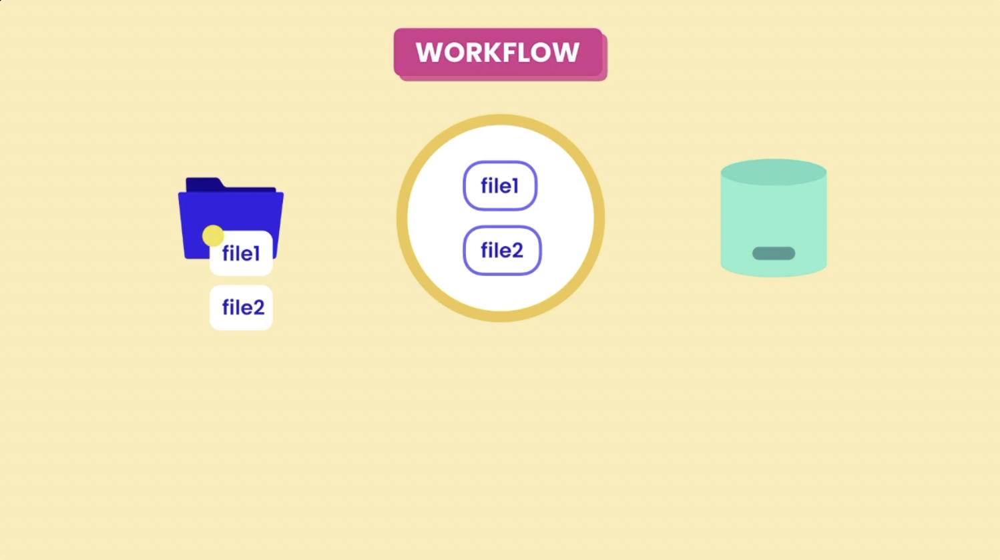

# git-notes

## Git cheatsheets


- https://jdsalaro.com/cheatsheet/git/index.html

# What is Git?

Git is the most popular version control system in the world because it's free, open source, super fast and scalable.

## Git Configuration

When using Git for the first time, it’s important to set up a few configuration settings to ensure your environment behaves consistently. These settings help Git associate your commits with your identity, choose the right editor, and handle line endings properly.

Git settings can be configured at **three levels**:

- **System level**: Applies to all users and repositories on the machine.
- **Global level**: Applies to all repositories for the current user.
- **Local level**: Applies to the specific repository in the current folder.


You can use the `git config` command with different flags to specify the level.

### Step 1. **Set Your User Name and Email**

These are required to associate commits with your identity.

```bash
git config --global user.name "Your Full Name"
git config --global user.email your.email@example.com
```

- Use **double quotes** if your name includes spaces.
- No need for quotes around the email unless it contains spaces (which is rare).

### Step 2. **Set Your Default Editor**

If you don’t specify an editor, on Mac, Git uses the system default—like `vim`, which may be unfamiliar.

To use **Visual Studio Code**:

```bash
git config --global core.editor "code --wait"
```

- The `--wait` flag tells Git to pause until you close the VS Code window.
- Make sure `code` is in your system’s path. If not, follow platform-specific instructions to add it.

### Step 3. **Edit Global Git Config File**

All global Git settings are stored in a plain text config file. You can edit it manually:

```bash
git config --global -e
```

This opens the global config file in your default editor (e.g., VS Code). You’ll see:

```ini
[user]
  name = Your Full Name
  email = your.email@example.com

[core]
  editor = code --wait
```

You can make manual changes here if needed.

### Step 4. **Configure Line Endings (core.autocrlf)**

Different operating systems handle end-of-line characters differently:

- **Windows**: Uses carriage return + line feed (`\r\n`) (`CRLF`)
- **macOS/Linux**: Use just line feed (`\n`)(`LF`)


Misaligned line endings can cause annoying diffs and conflicts. To manage this properly, configure the `core.autocrlf` setting.

#### Windows Users:

```bash
git config --global core.autocrlf true
```

- Converts `CRLF` to `LF` when storing files in the repo.
- Converts `LF` back to `CRLF` when checking out files.

#### macOS/Linux Users:

```bash
git config --global core.autocrlf input
```

- Converts `CRLF` to `LF` when storing files in the repo.
- Leaves line endings untouched on checkout.

This ensures consistent line endings across platforms and prevents errors in collaboration.


### Summary of Configuration Commands

```bash
# Set user identity
git config --global user.name "Your Name"
git config --global user.email your.email@example.com

# Set preferred text editor
git config --global core.editor "code --wait"

# Configure line endings
git config --global core.autocrlf true     # For Windows
git config --global core.autocrlf input    # For macOS/Linux

# Open global config file
git config --global -e
```

By setting up these configurations at the beginning, you ensure Git behaves predictably and avoids platform-related issues—especially with line endings.

## Git Workflow Basics

The daily Git workflow involves three main areas: the **working directory**, the **staging area** (also called the index), and the **repository**. Understanding how these areas interact is crucial for effective Git usage.

### The Three Areas of Git

1. **Working Directory**: Your project folder where you make changes to files
2. **Staging Area**: An intermediate step that holds what you're proposing for the next commit
3. **Repository**: The permanent storage where your project history is maintained

### Daily Workflow Process

The basic workflow follows these steps:

1. **Make Changes**: Modify files in your working directory
2. **Stage Changes**: Add modified files to the staging area using `git add`
3. **Review Changes**: Check what's staged before committing
4. **Commit Changes**: Permanently store the staged snapshot in the repository

### Understanding the Staging Area

The staging area is a unique feature of Git that doesn't exist in most other version control systems. It serves as:

- **A review mechanism**: You can review changes before committing
- **A selective commit tool**: You can stage only specific changes for a commit
- **A preparation area**: It holds what will become your next commit

#### ⚠️ Important Concept: Staging Area Persistence ⚠️

A common misconception is that the staging area becomes empty after a commit. This is incorrect. **After committing, the staging area contains the same snapshot that was just stored in the repository**. Think of it like a staging environment in software deployment—it either reflects what's currently in production or what's going to be deployed next.

### Practical Example

Let's walk through a complete workflow example:

#### Step 1: Initial Setup

```bash
# Start with an empty project directory
mkdir my-project
cd my-project
git init
```

#### Step 2: Add Files and Make First Commit

```bash
# Create some files
echo "Hello World" > file1.txt
echo "Git is awesome" > file2.txt
```


```bash
# Stage the files
git add file1.txt file2.txt
```


```bash
# Review what's staged
git status

# Commit the changes
git commit -m "Initial commit: Add basic files"
```


#### Step 3: Make Changes and Commit Again

```bash
# Modify a file
echo "Hello World - Updated" > file1.txt
```



```bash
# Stage the changes
git add file1.txt
```


```bash
# Commit with descriptive message
git commit -m "Fix typo in file1.txt"
```


#### Step 4: Delete Files

```bash
# Remove a file from working directory
rm file2.txt
```


```bash
# Stage the deletion
git add file2.txt
```


> **💡 Note**: Even though we're using `git add file2.txt` on a deleted file, Git understands this as staging the deletion. The `git add` command stages the current state of the working directory, whether that's adding new files, modifying existing files, or removing files.

```bash
# Commit the deletion
git commit -m "Remove unused file2.txt"
```


### How Git Stores Data

Unlike many version control systems that store deltas (changes), Git stores **complete snapshots** of your project at each commit. This allows Git to:

- Quickly restore the project to any previous state
- Efficiently compress and deduplicate data
- Provide fast access to any version of your project

Each commit contains:

- A unique identifier (hash)
- Information about who made the change and when
- A complete snapshot of the project at that point in time
- References to parent commits


This snapshot-based approach makes Git extremely efficient and reliable for version control.

Even though Git stores the whole content of the project in each snapshot, it doesn't take up too much memory because Git is very efficient. It compresses the data and doesn't store any duplicate content.


## Staging Files

### Initial File Creation

When you first initialize a Git repository, Git doesn't automatically track any files. You need to explicitly tell Git which files to track. Let's see this in action:

```bash
# Create files using standard Unix/Linux commands
echo "hello" > file1.txt
echo "hello" > file2.txt
```

After creating files, running `git status` will show them as **untracked files** (indicated in red), meaning Git is not yet tracking them.

### Adding Files to Git

To start tracking files, you use the `git add` command:

```bash
# Add a single file
git add file1.txt

# Add multiple files
git add file1.txt file2.txt

# Add all files with a specific extension
git add *.txt

# Add all files in the current directory (use with caution)
git add .
```

> **⚠️ CAUTION**: Be careful with `git add .` as it adds the entire directory recursively. You might accidentally add files you don't want in your repository (like large binary files, log files, or temporary files). To prevent this behaviour, d.

### Understanding File States

After adding files, `git status` will show them in **green**, indicating they're now in the staging area and ready to be committed.

### Modifying Files After Staging

Here's an important concept: when you modify a file after adding it to the staging area, Git maintains two versions:

1. **Staging Area**: Contains the version that was staged
2. **Working Directory**: Contains the current modified version

```bash
# Modify a file after staging it
echo "world" >> file1.txt  # Append "world" to file1.txt
```

Running `git status` now shows:

- Files in the staging area (green) - ready to commit
- Modified files in the working directory (red) - not yet staged


### Re-staging Modified Files

To include the latest changes in your next commit, you need to re-stage the modified file:

```bash
# Re-stage the modified file
git add file1.txt
# or
git add .
```

Now `git status` shows all files are staged and ready for commit.

### Key Points to Remember

1. **Git doesn't auto-track files**: You must explicitly add files to start tracking them
2. **Staging is a snapshot**: When you `git add` a file, Git takes a snapshot of its current state
3. **Modifications require re-staging**: If you modify a file after staging it, you need to stage it again
4. **Use `git status` frequently**: It helps you understand what's staged vs. what's in your working directory

## Committing Changes

Once you have files staged in the staging area, you can commit them to permanently store the snapshot in your Git repository.

### Basic Commit with Message

The most common way to commit is using the `-m` flag to provide a commit message:

```bash
git commit -m "Initial commit"
```

This creates a commit with a short, descriptive message that identifies what the snapshot represents.

### Detailed Commit Messages

Sometimes a short one-liner isn't sufficient. You might need to explain context, constraints, or provide additional details. For detailed commit messages:

```bash
git commit
```

This opens your default editor (like VS Code) where you can write a multi-line commit message:

```bash
# Example commit message format:
Initial commit

This is our first commit to the repository. We're adding basic file structure
and initial content to get started with the project.
```

**Commit Message Format:**

- **First line**: Short description (ideally under 80 characters)
- **Blank line**: Separates short description from detailed description
- **Detailed description**: Additional context, explanations, or constraints

> **💡 Note**: Lines starting with `#` are comments and will be ignored by Git.

### Commit Statistics

After committing, Git shows statistics about what was changed:

```bash
[main (root-commit) abc1234] Initial commit
 2 files changed, 3 insertions(+)
 create mode 100644 file1.txt
 create mode 100644 file2.txt
```

This tells you:

- Number of files changed
- Number of lines inserted/deleted
- Which files were created/modified

### Working Directory State After Commit

After a successful commit:

- Your working directory becomes "clean" (no uncommitted changes)
- The staging area contains the same content as the last commit
- All three areas (working directory, staging area, repository) are in sync

### Best Practices for Committing

#### 1. **Commit Size**

- **Don't commit too frequently**: Avoid commits like "update file1", "update file2"
- **Don't commit too infrequently**: Don't wait days or weeks to commit
- **Aim for logical checkpoints**: Commit when you reach a meaningful state
- **Real-world guideline**: 5-10 commits per day (but don't force it)

#### 2. **Logical Separation**

Each commit should represent a single, logical unit of work:

```bash
# ❌ Bad: Mixing unrelated changes
git commit -m "Fix bug and fix typo"

# ✅ Good: Separate commits for separate concerns
git commit -m "Fix authentication bug in login form"
git commit -m "Fix typo in README file"
```

#### 3. **Meaningful Commit Messages**

- **Be descriptive**: Explain what the commit accomplishes
- **Use present tense**: "Fix bug" instead of "Fixed bug"
- **Be consistent**: Follow the same convention across your team
- **Keep it simple**: If your commit represents a single unit of work, writing a good message becomes easier

#### 4. **Commit Message Examples**

```bash
# ✅ Good examples:
git commit -m "Add user authentication feature"
git commit -m "Fix memory leak in image processing"
git commit -m "Update API documentation"
git commit -m "Refactor database connection logic"

# ❌ Bad examples:
git commit -m "stuff"
git commit -m "fix"
git commit -m "updates"
git commit -m "wip"
```

### Unstaging Changes

If you accidentally stage changes that shouldn't be in the same commit, you can unstage them:

```bash
# Unstage a specific file
git reset HEAD <filename>

# Unstage all files
git reset HEAD
```

This moves files back to the working directory without losing your changes.

### Best Practices

1. **Meaningful Commit Messages**: Each commit should have a clear, descriptive message explaining what the snapshot represents
2. **Review Before Committing**: Always check what's staged using `git status` before committing
3. **Atomic Commits**: Group related changes togethe dr in single commits
4. **Frequent Commits**: Make commits often to create a detailed project history

## The .gitignore File

A `.gitignore` file is used to keep a tidy and efficient repository. It tells Git which files or directories to ignore, ensuring that unnecessary clutter—like temporary files, logs, and build artifacts—doesn’t get committed. This not only keeps your repository clean but also improves collaboration by preventing irrelevant files from being shared among team members.

A `.gitignore` file works by specifying patterns for files and directories that Git should ignore when tracking changes.

Step 1. **Creating the File**

- To use `.gitignore`, simply create a text file named `.gitignore` in the root of your repository. This file can contain a list of patterns for files and directories you want Git to ignore.

Step 2. **Pattern Matching**

- Inside the `.gitignore` file, you can specify patterns using various rules:

  - **Basic patterns:** Just the name of a file or directory (e.g., `temp/` ignores the `temp` directory).
  - **Wildcards:** Use `*` to match any characters (e.g., `*.log` ignores all `.log` files).

    - The double asterisk (`**`) in a `.gitignore` file is a powerful wildcard pattern that allows you to match files and directories at any level of the directory hierarchy.

      - Usage of `**`

        1. **Match Any Directory Depth** :

           - You can use `**` to match files or directories regardless of how deep they are nested. For example:

             ```javascript
             **/temp/
             ```

             This pattern will ignore any directory named `temp`, no matter where it appears in the project structure (e.g., `src/temp/`, `logs/temp/`, etc.).

        2. **Match Files Across Directories** :

        - If you want to ignore all files of a certain type in any subdirectory, you can specify:

          ```bash
          **/*.log
          ```

          This will ignore all `.log` files in any directory, such as `logs/file.log` or `data/logs/another_file.log`.

        3. **Combining with Other Patterns** :

        - You can combine `**` with other patterns to create more complex rules. For example:

          ```javascript
          **/build/**/*
          ```

          This ignores all files in any `build` directory, regardless of its depth.

        #### Examples

        - **Ignore All Folders Named `node_modules`** :

          ```javascript
          **/node_modules/
          ```

        - **Ignore All `.tmp` Files in Any Directory** :

          ```
          **/*.tmp
          ```

        - **Ignore All Files Named `config.json` in Any Directory** :

          ```arduino
          **/config.json
          ```

  - **Negation:** Prefix a pattern with `!` to negate it, meaning that Git will track files that match this pattern even if a broader pattern would ignore them (e.g., `!important.log` allows tracking of `important.log`).
  - **Comments:** Lines starting with `#` are treated as comments and ignored.

Step 3. **Effect on Tracking**

- When you run `git add`, Git checks the `.gitignore` file and skips any files or directories that match the specified patterns. This means they won’t be staged for commit or included in your repository.

Step 4. **Updating the `.gitignore`**

- If you add new files or directories that you want to ignore after the initial commit, you may need to remove them from tracking using, because `.gitignore` only ignores files and directories in git that you haven't already included in your directory or repository. So if you accidentally include a file in your git repository and then later add it to `.gitignore`, git **is not** going to ignore that. To stop this problem, you have to remove this file from the staging area, which is what you're proposing for the next commit. To see the files in your directory, you can use:

  ```bash
  git ls-files
  ```

- The `git rm` command allows you to remove a file from **both** the working directory and the staging area. In this case, you don't want to remove the file from the working directoy, but you do want to remove it from the staging area (from the index). To do this you will use `git rm --cached`. You may have to use the recursive removal flag, `-r`, to remove directories from the staging area.

  ```bash
  git rm --cached -r <file|directory>
  ```

- Then, adding the appropriate patterns to your `.gitignore` file will prevent them from being tracked in future commits.

Step 5. **Global `.gitignore`**

- You can also set up a global `.gitignore` file that applies to all your repositories. This is useful for ignoring files like OS-specific files or IDE configurations. You can configure it with:

```bash
git config --global core.excludesfile ~/.gitignore_global
```

If you go to [github.com/github/gitignore](https://github.com/github/gitignore), you can see various `.gitignore` templates from various different languages.

Using a `.gitignore` file is a simple yet powerful way to maintain a clean and organized repository, ensuring that only relevant files are tracked by Git. This helps streamline collaboration and keeps your version history focused on the actual project files.

## Resetting commits

<p align="center">

</p>

`--soft`: Removes the commit

<p align="center">

</p>

`--mixed`: Removes the commit and unstages files

<p align="center">

</p>

`--hard`: Removes the commit, unstages files, and discards the local changes

<p align="center">

</p>

## Working on a forked repository

1. Fork a remote repository for an open source project and clone it on your local machine

<p align="center">

</p>

```bash
git clone https://github.com/your-username/forked_repo-name.git
```

- This forked repository is not connected to the original repository, so from time to time, it can become out of sync with the original repository. If other people contribute to the base repository and add new commits to the main branch, you are not going to be aware of those new commits.

To fix this and keep the forked repository up to date:

2. In the local repository you have a reference to the forked repositrory called `origin`. Add another reference to the original repository called `base`.

<p align="center">

</p>

```bash
git remote add base https://github.com/original-owner/repo-name.git
```

3. Pull the commits from the `base` repository and then push them to the forked (`origin`) repositroy.

<p align="center">

</p>

```bash
# Fetch the Latest Commits from the Original Repository:
git fetch base
# Merge the Changes into Your Local Main Branch:
git checkout main
git merge base/main
# Push the Changes to Your Forked Repository:
git push origin main
```

## Collaborative Workflow Best Practices

### Step 1: Check remote directory

A remote is a shared Git repository that allows multiple collaborators to work on the same Git project from different locations.
To view the remote directory, type

```bash
git remote -v
```

If remote directory has never been added to your local directory, use the following command

```bash
git clone remote_location clone_name
```

Otherwise, move onto step 2

### Step 2: Fetch changes from the remote

```bash
git fetch
```

In Git, the git fetch command downloads objects from the origin remote repository.
The changes, however, are not merged into the current branch-name branch.
Instead, they are stored in the origin/branch-name branch, waiting to be merged.

#### Example:

```bash
git branch -a
* master

git fetch
remote: Counting objects: 5, done.
remote: Compressing objects: 100% (5/5), done.
remote: Total 5 (delta 1), reused 0 (delta 0)
Unpacking objects: 100% (5/5), done.
From /home/ccuser/workspace/curriculum-a/science-quizzes
 * [new branch]      master     -> origin/master

git branch -a
* master
  remotes/origin/master
```

In the provided example, using the git branch -a command to see the existing branches, you can see that fetched data has been stored in a new origin/master branch.

### Step 3: Merge changes from the remote

```bash
git merge origin/branch-name
```

### Step 4: Create a branch to work on a new project feature and switch over to that branch

```bash
git branch new-branch
git switch new-branch
```

### Step 5: Develop the feature on a branch and commit the work

```bash
git add files
git commit -m "message"
```

### Step 6: Fetch and merge from the remote again (in case new commits were made)

```bash
git fetch
git merge origin/branch-name
```

Steps 2 and 6 are a safeguard against merge conflicts, which occur when two branches contain file changes that cannot be merged with the git merge command.

### Step 7: Push branch up to the remote for review

```bash
git push origin branch-name
```

### Step 8: Switch back to main branch and delete new branch (if new feature is fully complete)

```bash
git switch main
git branch -D branch-name
```
